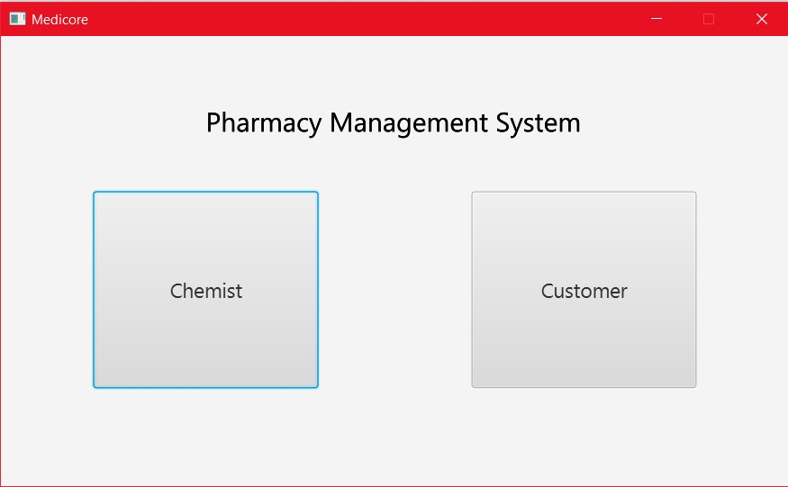
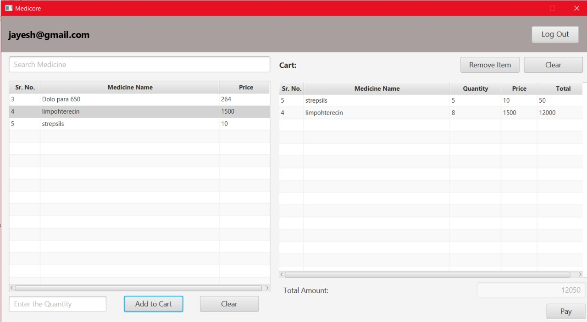
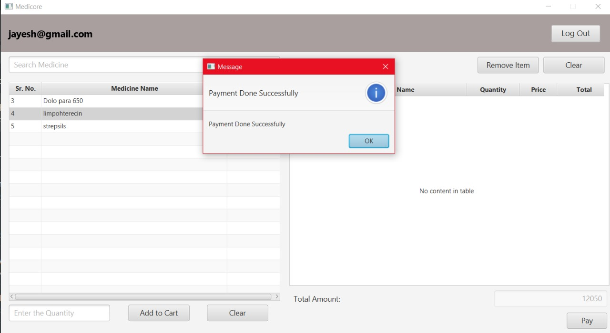

# Pharmacy Management System Desktop Application (JUnit Testing) 

## Homepage

## Customer Login

## Customer Registraion

### Customer Registraion 2

### Customer Registraion 3

### Customer Registraion 4

### Customer Registraion 5

## Admin's Dashboard

### Admin's Dashboard 2

### Admin's Dashboard 2

### Update Medicine 

## Customer's Dashboard

### Customer's Dashboard 2

